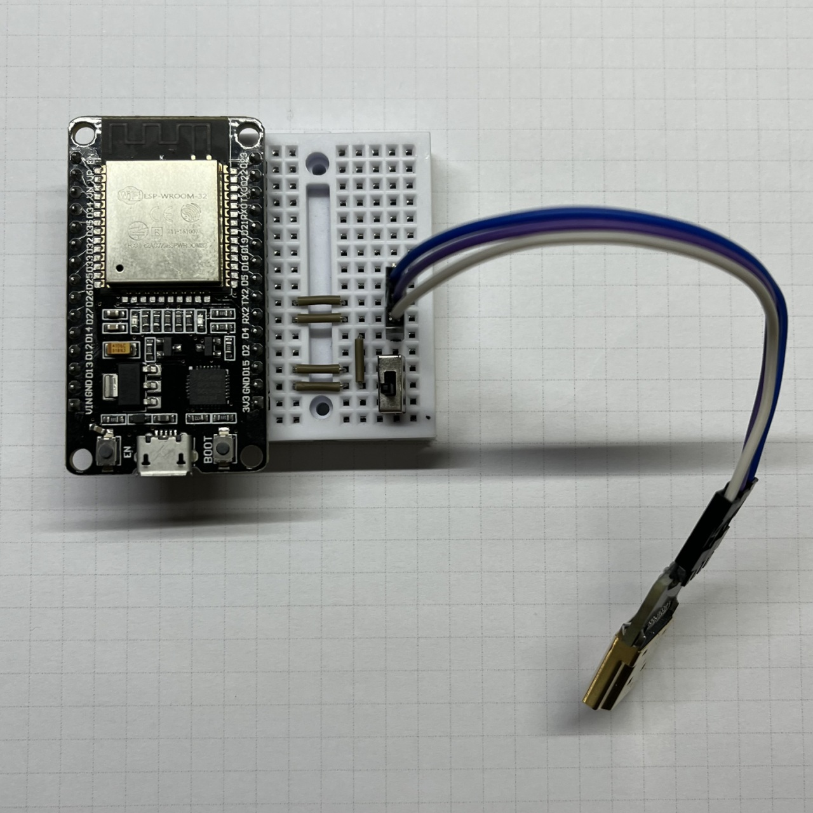

# Digimon-SwanLink-Tool

Project using ESP32 to communicate with Digimon toys.

Sending SwanLink signals to D-3(2000) or D-Ark(2001).

An approach to get ultimate Digimon on D-3 or unlock Secret Area-S on D-Ark without WonderSwan.

## Schematic

GPIO_NUM_16 → HDMI PIN13

GPIO_NUM_17 → HDMI PIN9

GND → HDMI PIN17

## D-3_SwanLink_Jogress.ino

https://www.youtube.com/watch?v=jiJaQKZQ_ms

SwanLink Jogress Evolution for D-3(2000).

Jogress with Wonderswan(Digimon Adventure 02: D1 Tamers).

Fouce Adult Level or Perfect Level Jogress to Ultimate Level.

## D-Ark_SwanLink_Battle.ino

https://www.youtube.com/watch?v=EMvo80xkd9Q

SwanLink punching bag for D-Ark(2001).

Versus Wonderswan Impmon from Digimon Tamers Battle Spirit.

Not 100% winning!

## ESP32_SwanLink_Tool.ino

2 in 1 SwanLink Tool.

Need to add a switch between GPIO_NUM_15 and GND.

GPIO_NUM_15 → SWITCH → GND

Switch ON : D-Ark SwanLink Punching

Switch OFF: D-3 SwanLink Jogress Evolution

## SwanLink_Adapter_Gerber.zip
 

 Gerber file for SwanLink Adapter PCB.
 
 PCB thickness: 1.6mm
 
 HDMI Male Connector 19Pin

 2.54mm Pin Header
